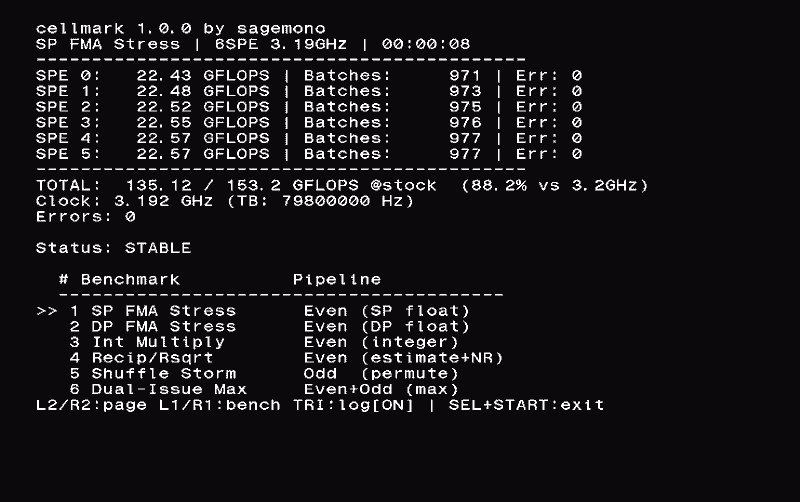

# cellmark

A stress test and benchmark suite for the PlayStation 3, focused on validating Cell BE / XDR overclocks and characterising disk I/O.

This repository publishes the **benchmark kernels only.** The inner loops that do the actual measuring. The application glue (rendering, input handling, SPU manager, GCM setup, packaging tooling) is being held back for a cleanup pass and will be released later. The compiled `.pkg` is shipped as a [release](../../releases) so anyone with a CFW capable PS3 can run it without building anything.

---

## What's in this repo

The published files are exactly the parts other people are most likely to learn something from:

| File | What it is |
|---|---|
| [`spu/spu_fma_kernel.S`](spu/spu_fma_kernel.S) | SP FMA stress - 64× unrolled, 6 chains, ~96% of even-pipeline peak |
| [`spu/spu_dp_fma_kernel.S`](spu/spu_dp_fma_kernel.S) | DP FMA stress - 13 chains to hide the 13-cycle DFMA latency |
| [`spu/spu_int_kernel.S`](spu/spu_int_kernel.S) | Integer multiply-add - `mpya` 4-way SIMD, 7 chains |
| [`spu/spu_recip_kernel.S`](spu/spu_recip_kernel.S) | Reciprocal + rsqrt with Newton-Raphson refinement, zero-stall pipeline |
| [`spu/spu_shuf_kernel.S`](spu/spu_shuf_kernel.S) | Odd-pipe shuffle storm - 5 chains, hides the 4-cycle latency |
| [`spu/spu_dual_kernel.S`](spu/spu_dual_kernel.S) | Maximum dual-issue: even-pipe FMA + odd-pipe shufb every cycle |
| [`ppu/ppe_benchmarks.c`](ppu/ppe_benchmarks.c) | PPE: VMX FMA, L1/L2 read bandwidth, L1/L2 latency |
| [`ppu/disk_benchmark.c`](ppu/disk_benchmark.c) | HDD/SSD/SSHD sequential + random 4K + 13-probe diagnostic suite |
| [`include/stress_common.h`](include/stress_common.h) | PPE↔SPU shared parameter / result structs and constants |
| [`docs/disk_tuning.md`](docs/disk_tuning.md) | The SSHD investigation: 5.7 MB/s -> 47 MB/s |

The `.h` files for `ppe_benchmarks` and `disk_benchmark` are included so the `.c` files are readable in isolation.

---

## What cellmark actually does (full app)

Four pages, switched with **L2/R2** on a controller:

### 1. Cell - SPU compute (all 6 SPEs in parallel)

| Mode          | Pipeline           | Peak (3.2 GHz) | Purpose                            |
|---------------|--------------------|----------------|------------------------------------|
| SP FMA Stress | Even (SP float)    | 153.6 GFLOPS   | OC stability, deterministic verify |
| DP FMA Stress | Even (DP float)    | 13.1 GFLOPS    | DP throughput (7-cycle stall) |
| Int Multiply  | Even (`mpya`)      | 153.6 GIOPS    | Integer pipeline |
| Recip/Rsqrt   | Even (estimate+NR) | 76.8 GOPS      | Newton-Raphson refinement |
| Shuffle Storm | Odd (`shufb`)      | 76.8 GOPS      | Odd pipeline |
| Dual-Issue    | Even+Odd           | 230.4 GOPS     | Theoretical max |

SP FMA stress verifies a deterministic accumulator chain at intervals; if a single bit drifts, the SPE reports an error and the run is flagged unstable (unlikely for this to happen). Other modes track throughput only.

### 2. PPE - PowerPC core benchmarks (PPE0 thread, SPUs idle)

- **VMX FMA** - `vmaddfp` throughput, 6 chains x 8x unrolled (~96% of 8 GFLOPS/GHz peak)
- **L1 / L2 read bandwidth** - sequential VMX loads, load-ahead pattern hides 7-cycle latency
- **L1 / L2 latency** - Pointer chase using Sattolo's algorithm, true load-to-use ns

True multithreaded benchmarks are planned for future releases, though it will take a while to implement due to the nature of multithreading on Cell.

### 3. XDR - memtest86+ style memory test (15 patterns)

15 sub-tests cycle automatically across **all 6 SPEs in parallel**, partitioning XDR into per-SPE slices. Allocates as much XDR as the OS will give.

Sequential, Walking 1/0, Checkerboard, Random, Moving Inversions, Bank Hammer, R/W Turnaround, Bandwidth, Own Address, Modulo-N, Block Move, Bit Fade, BW Pipelined, Coherency, Latency.

### 4. Disk I/O - HDD/SSD/SSHD characterisation

Sequential 64KB and random 4K read/write on a 32 MB test file (writes are post-`fsync` these are true media latency, not write-cache). A 13-probe diagnostic suite separates per-call LV2 overhead from FAT cluster fragmentation, exercises `cellFsSetIoBuffer` and `cellFsStRead`, and finishes with three contention probes that simulate a real game's I/O mix (audio + texture streaming + sequential level load). See [docs/disk_tuning.md](docs/disk_tuning.md) for what those probes actually told us.

---

## Running it

The compiled package is on the [Releases](../../releases) page.

1. Transfer `cellmark.pkg` to the PS3 (FTP, USB, `/dev_hdd0/packages/`, etc.)
2. Install via Package Manager (`★ Install Package Files`)

**Controls:**

| Button                | Action                                  |
|-----------------------|-----------------------------------------|
| **L2 / R2**           | Previous / next page                    |
| **L1 / R1 / D-pad**   | Previous / next benchmark within page   |
| **X (Cross)**         | Run selected disk bench / probe suite   |
| **Square**            | Toggle disk bench / probe view          |
| **Triangle**          | Toggle file logging                     |
| **SELECT + START**    | Exit                                    |

File logging appends to `/dev_hdd0/game/CELLMARK0/USRDIR/cellmark.log` on every mode change, every memtest pass, and on exit. Useful for long stability runs where you want a paper trail of what passed before something hung.

---

## Compatibility

| | |
|---|---|
| **Console**   | PS3 with CFW/HEN (retail or DEX) |
| **Firmware**  | Tested on Evilnat 4.92. Should work on any modern CFW. |
| **Best on**   | All. Though if you are chasing OC numbers, pre CECH-2000 systems are the best, but there are exceptions even among 2000 series (same motherboard revision, diferent part number or manufacturer) |

Different Cell process nodes (90 nm / 65 nm / 45 nm) hit different stability ceilings, and most non-trivial overclocks require overvolting. Use at your own risk! See [cell-xdr-overclocking](https://github.com/sagemono/cell-xdr-overclocking) for the hardware side.

---

## Why this exists

This was built alongside [cell-xdr-overclocking](https://github.com/sagemono/cell-xdr-overclocking) as a way to verify CELL/XDR overclock stability and measure how much performance an OC actually unlocks. The compute kernels tell you whether the SPEs are doing math correctly at the new clock; the memtest catches XDR errors that only appear under sustained load; the disk page exists because the stock PS3 disk benchmarks were terrible and an SSHD upgrade turned out to be bottlenecked entirely on the OS, not the drive.

If you find a configuration that fails here that worked in something else, open an issue! That's exactly the data this was built to surface.

---

## Credits and sources

- **Catherine H. Crawford, Paul Henning, Michael Kistler, Cornell Wright** - [Accelerating Computing with the Cell Broadband Engine Processor](https://dl.acm.org/doi/10.1145/1366230.1366234)
- **Michael Kistler, Michael Perrone, Fabrizio Petrini** - [CELL MULTIPROCESSOR COMMUNICATION NETWORK: BUILT FOR SPEED](https://users.cecs.anu.edu.au/~Alistair.Rendell/hons09/ieeemicro-cell.pdf)
- **David A. Bader, Virat Agarwal, Seunghwa Kang** - [Computing discrete transforms on the Cell Broadband Engine](https://davidbader.net/publication/2009-bak/2009-bak.pdf)
- **Farshad Khunjush, Nikitas J. Dimopoulos** - [Extended Characterization of DMA Transfers on the Cell BE Processor](https://ieeexplore.ieee.org/document/4536190)
- **David A. Bader, Virat Agarwal** - [FFTC: Fastest Fourier Transform for the IBM Cell Broadband Engine](https://davidbader.net/publication/2007-ba/2007-ba.pdf) and [source code](https://github.com/Bader-Research/CellBuzz/tree/main/fft)
- **David A. Bader , Virat Agarwal, Kamesh Madduri, Seunghwa Kang** - [High performance combinatorial algorithm design on the Cell Broadband Engine processor](https://davidbader.net/publication/2007-bamk/2007-bamk.pdf)
- **David A. Bader, Sulabh Patel** - [High Performance MPEG-2 Software Decoder on the Cell Broadband Engine](https://ieeexplore.ieee.org/document/4536234) and [source code](https://github.com/Bader-Research/CellBuzz/tree/main/mpeg2)
- **Olaf Lubeck, Michael Lang, Ram Srinivasan, Greg Johnson** - [Implementation and performance modeling of deterministic particle transport (Sweep3D) on the IBM Cell/B.E.](https://dl.acm.org/doi/abs/10.1155/2009/784153)
- **Jakub Kurzak, Jack Dongarra** - [Implementation of the Mixed-Precision High Performance LINPACK Benchmark on the CELL Processor](https://www.netlib.org/lapack/lawnspdf/lawn177.pdf)
- **Arnd Bergmann** - [Linux on Cell Broadband Engine status update](https://www.kernel.org/doc/ols/2007/ols2007v1-pages-21-28.pdf)
- **Daniel A. Brokenshire** - [Maximizing the power of the Cell Broadband Engine processor: 25 tips to optimal application performance](https://arcb.csc.ncsu.edu/~mueller/cluster/ps3/25tips.pdf)
- **David A. Bader, Seunghwa Kang** - [Optimizing JPEG2000 Still Image Encoding on the Cell Broadband Engine](https://ieeexplore.ieee.org/document/4625836) and [source code](https://github.com/Bader-Research/CellBuzz/tree/main/jpeg2000)
- **Daniel Jiménez-González Xavier Martorell, Alex Ramírez** - [Performance Analysis of Cell Broadband Engine for High Memory Bandwidth Applications](https://ieeexplore.ieee.org/document/4211037)
- **Luke Cico, Robert Cooper, Jon Greene, Michael Pepe** - [Performance Benchmarks and Programmability of the IBM/Sony/Toshiba Cell Broadband Engine Processor](https://archive.ll.mit.edu/HPEC/agendas/proc06/Day3/05_Cico_Pres.pdf)
- **Jacob Johnson** - [POWER EFFICIENCY AND SCALING OF THE CELL BROADBAND ENGINE](https://etda.libraries.psu.edu/files/final_submissions/2582)
- **Hauser, Jochem H., Cambier Jean-Luc, Surampudi Surya, Gollnick Torsten** - [Programming the IBM Cell Broadband Engine a general parallelization strategy](https://apps.dtic.mil/sti/pdfs/ADA525908.pdf)
- **Filip Blagojevic, Alexandros Stamatakis, Christos D. Antonopoulos, Dimitrios S. Nikolopoulos** - [RAxML-Cell: Parallel Phylogenetic Tree Inference on the Cell Broadband Engine](https://ieeexplore.ieee.org/document/4227995)
- **Pieter Bellens, Josep M. Perez, Felipe Cabarcas, Alex Ramirez, Rosa M. Badia, Jesus Labarta** - [CellSs: Scheduling techniques to better exploit memory hierarchy](https://dl.acm.org/doi/abs/10.1155/2009/561672)
- **Michael Gschwind, Fred G. Gustavson, Jan Prins** - [High Performance Computing with the Cell Broadband Engine](https://dl.acm.org/doi/10.1155/2009/979236)
- **Michael Kistler, John Gunnels, Daniel Brokenshire, Brad Benton** - [Programming the Linpack benchmark for the IBM PowerXCell 8i processor](https://dl.acm.org/doi/10.1155/2009/401691)
- **B.C. Vishwas, Abhishek Gadia and Mainak Chaudhuri** - [Implementing a parallel matrix factorization library on the cell broadband engine](https://dl.acm.org/doi/abs/10.1155/2009/710321)
- **Michael Gschwind** - [The Cell Broadband Engine: Exploiting Multiple Levels of Parallelism in a Chip Multiprocessor](https://courses.grainger.illinois.edu/ece511/fa2008/papers/cell.pdf)
- **Samuel Williams, John Shalf, Leonid Oliker, Shoaib Kamil, Parry Husbands, Katherine Yelick** - [The potential of the cell processor for scientific computing](https://dl.acm.org/doi/10.1145/1128022.1128027)
- **Sándor Héman, Niels Nes, Marcin Zukowski, Peter Boncz** - V[ectorized Data Processing on the Cell Broadband Engine](https://ir.cwi.nl/pub/12426/12426B.pdf)
- **Nascar1243, villahed94, gypsy, RGBeter, NGX, DoublesAdvocate** - Testing, feedback and moral support.
- **Sony / IBM / Toshiba** - Cell Broadband Engine Programming Handbook (v1.1, April 2007) and the SPU instruction timing reference; the PPE VMX latencies in `ppe_benchmarks.c` come from there.
- **memtest86+** - The test methodology used in the `spu_memtest.c` follows the standard pattern set: Walking 1/0, Checkerboard, Moving Inversions, Bank Hammer, Bit Fade, etc. The patterns themselves are decades-old academic memory-testing techniques; this is an independent SPU/DMA implementation of them, but credit where it's due.
- **The PS3 developer community** - `ps3py`, `scetool`, and decades of patient reverse engineering.

---

## License

[LICENSE](LICENSE). Applies to everything in this repository now and to the full source when it's released.

---

## Author

[sagemono](https://github.com/sagemono) - design, implementation, and the days lost to figuring out why `cellFsRead` was returning 9 MB/s.
